# Trần Hưng Bảo Hoàng 65131131

<a href="./HelloWorld"><b>Bài TH1: Tạo ứng dụng HelloWorld</b></a>

 
<table>
<tr>
<td width="60%" valign="top">
<ul>
  <li>Tạo ứng dụng HelloWorld</li>
</ul>
</td>
<td width="40%">
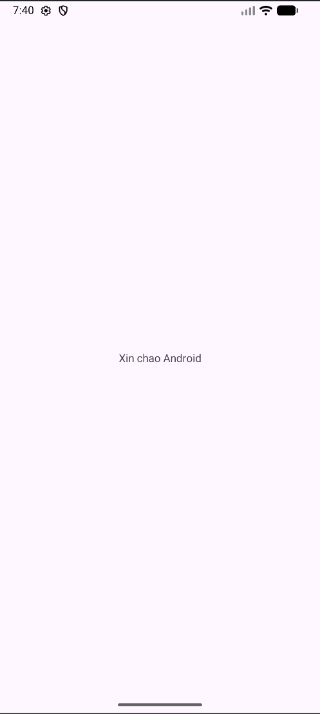
</td>
</tr>
</table>

<a href="./Tong2So/"><b>Bài TH2: Tính tổng 2 số</b></a>

 
<table>
<tr>
<td width="60%" valign="top">
<ul>
  <li>Thiết kế giao diện</li>
  <li>Xử lý sự kiện onClick </li>
  <li>Tính tổng 2 số</li>
</ul>
</td>
<td width="40%">
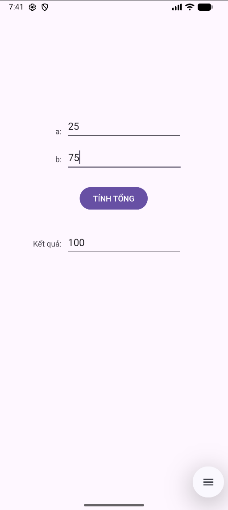
</td>
</tr>
</table>

<a href="./BaiTH3_LinearLayOut01/"><b>Bài TH3: LinearLayout</b></a>

 
<table>
<tr>
<td width="60%" valign="top">
<ul>
  <li>Tạo 3 nút bấm với LinearLayout</li>
</ul>
</td>
<td width="40%">
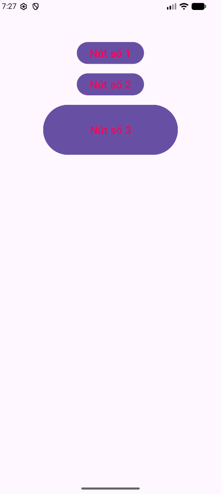
</td>
</tr>
</table>

<a href="./BaiTH4_LinearLayOut_Tong2So/"><b>Bài TH4: Giao diện tính toán</b></a>

 
<table>
<tr>
<td width="60%" valign="top">
<ul>
  <li>Giao diện cộng trừ nhân chia</li>
</ul>
</td>
<td width="40%">
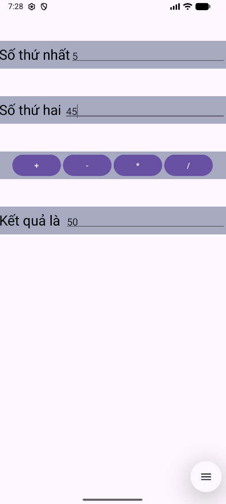
</td>
</tr>
</table>

<a href="./BaiTH5_XuLySuKien1/"><b>Bài TH5: Xử lý sự kiện</b></a>

 
<table>
<tr>
<td width="60%" valign="top">
<ul>
  <li>Xử lý cộng trừ nhân chia</li>
</ul>
</td>
<td width="40%">
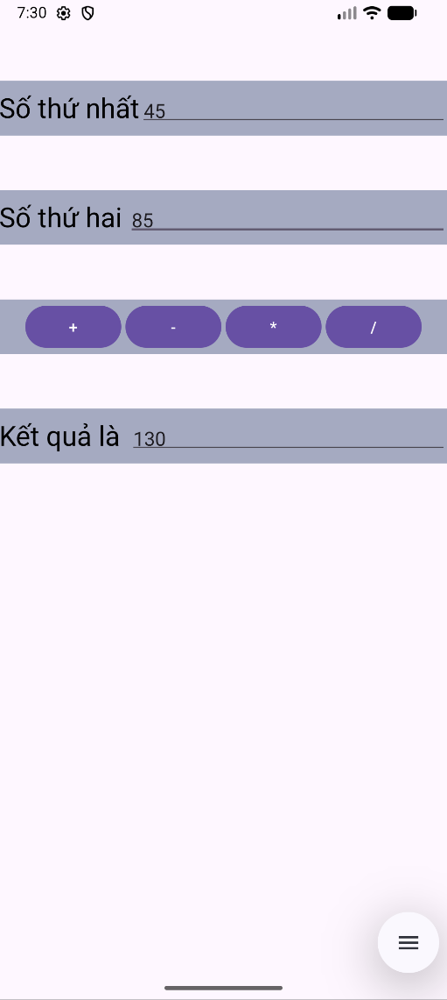
</td>
</tr>
</table>

<a href="./BaiTH6_XuLySuKien_TinhTong/"><b>Bài TH6: Tính tổng</b></a>

 
<table>
<tr>
<td width="60%" valign="top">
<ul>
  <li>Xử lý sự kiện tính tổng</li>
</ul>
</td>
<td width="40%">
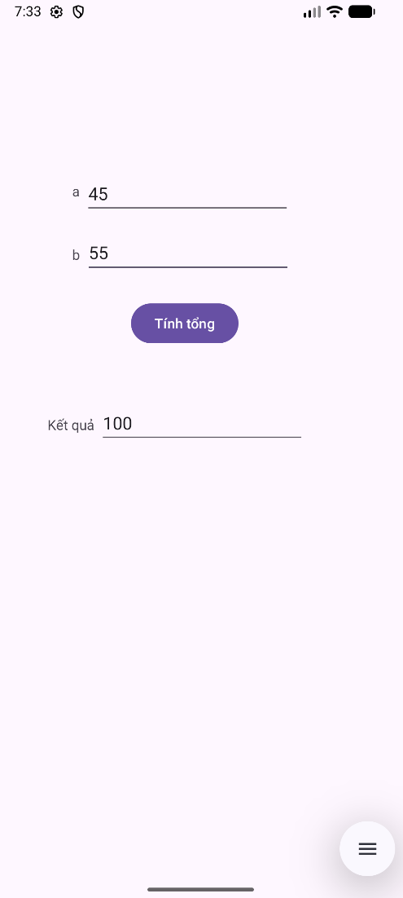
</td>
</tr>
</table>

<a href="./BaiTH7_ListView1/"><b>Bài TH7: ListView</b></a>

 
<table>
<tr>
<td width="60%" valign="top">
<ul>
  <li>Làm việc với ListView</li>
</ul>
</td>
<td width="40%">
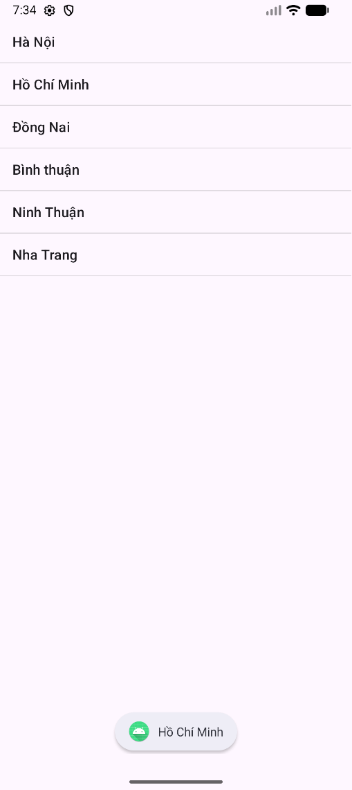
</td>
</tr>
</table>

<a href="./BaiTH8_TuyChinhLV/"><b>Bài TH8: Tùy chỉnh ListView</b></a>

 
<table>
<tr>
<td width="60%" valign="top">
<ul>
  <li>Custom ListView</li>
</ul>
</td>
<td width="40%">
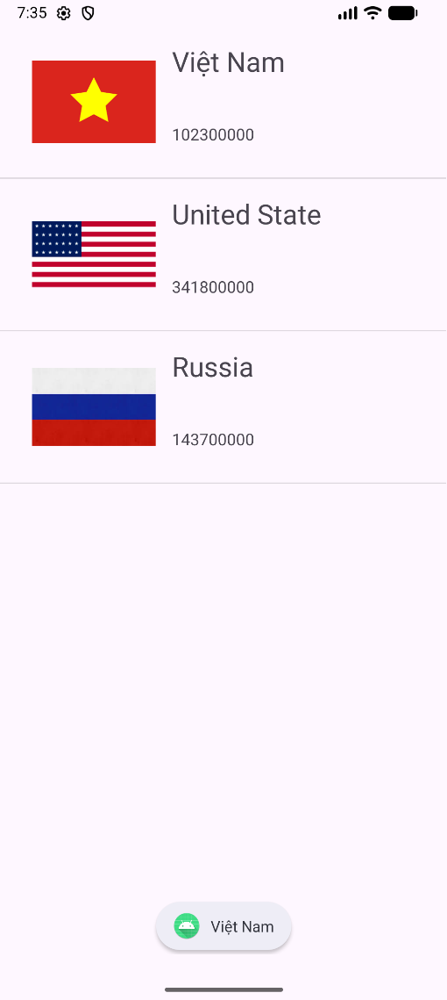
</td>
</tr>
</table>

<a href="./BaiTH9_Recyclerview/"><b>Bài TH9: RecyclerView</b></a>

 
<table>
<tr>
<td width="60%" valign="top">
<ul>
  <li>Làm việc với RecyclerView</li>
</ul>
</td>
<td width="40%">

</td>
</tr>
</table>

<a href="./DrawableShape/"><b>Drawable Shape</b></a>

 
<table>
<tr>
<td width="60%" valign="top">
<ul>
  <li>Tạo background bằng Drawable</li>
</ul>
</td>
<td width="40%">
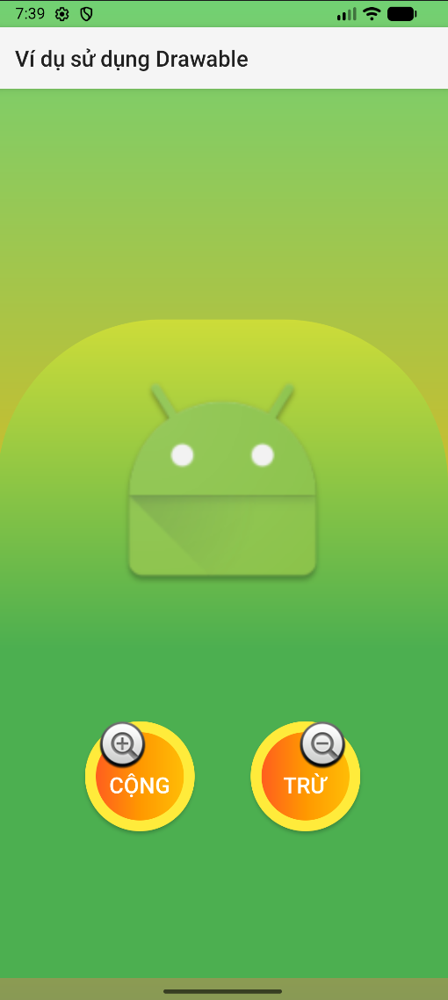
</td>
</tr>
</table>

<a href="./BaiTH10_ViduIntentDonGian/"><b>Bài TH10: Ví dụ Intent đơn giản</b></a>

 
<table>
<tr>
<td width="60%" valign="top">
<ul>
  <li>Vidu1 trên phần Intent</li>
</ul>
</td>
<td width="40%">
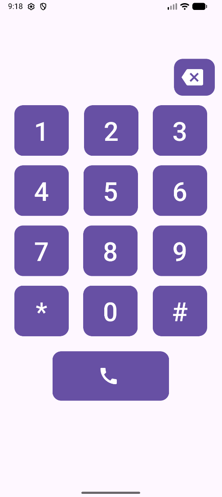
</td>
</tr>
</table>

<a href="./BaiTH11FragmentTinh/"><b>Bài TH11: Fragment Tinh</b></a>

 
<table>
<tr>
<td width="60%" valign="top">
<ul>
  <li>Fragment Tinh </li>
</ul>
</td>
<td width="40%">
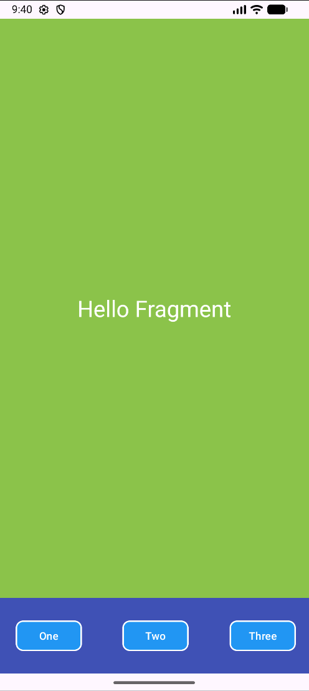
</td>
</tr>
</table>

<a href="./BaiTH12FragmentDong/"><b>Bài TH12: Fragment Dong</b></a>

 
<table>
<tr>
<td width="60%" valign="top">
<ul>
  <li>Sử dụng Fragment Dynamic</li>
</ul>
</td>
<td width="40%">
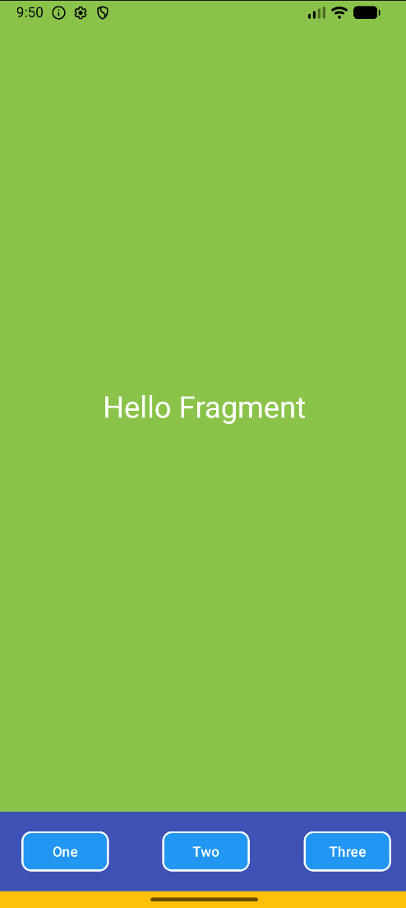
</td>
</tr>
</table>

<a href="./BaiTH13ThayDoiFragment/"><b>Bài TH13: Thay đổi Fragment</b></a>

 
<table>
<tr>
<td width="60%" valign="top">
<ul>
  <li>Fragment Tinh </li>
</ul>
</td>
<td width="40%">
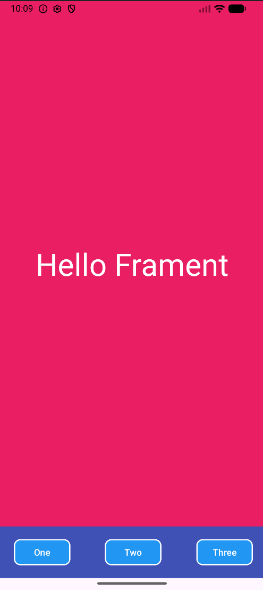
</td>
</tr>
</table>

<h3>BÀI TẬP LÀM THÊM</h3>

<a href="./WeatherForecast/"><b>Weather Forecast</b></a>

 
<table>
<tr>
<td width="60%" valign="top">
<ul>
  <li>Gọi API OpenWeather</li>
  <li>Hiển thị thời tiết</li>
</ul>
</td>
<td width="40%">

</td>
</tr>
</table>

<a href="./NewsApp/"><b>News App</b></a>

 
<table>
<tr>
<td width="40%" valign="top">
<ul>
  <li>Đọc RSS VNExpres</li>
  <li>Hiển thị bằng WebView</li>
</ul>
</td>
<td width="30%">
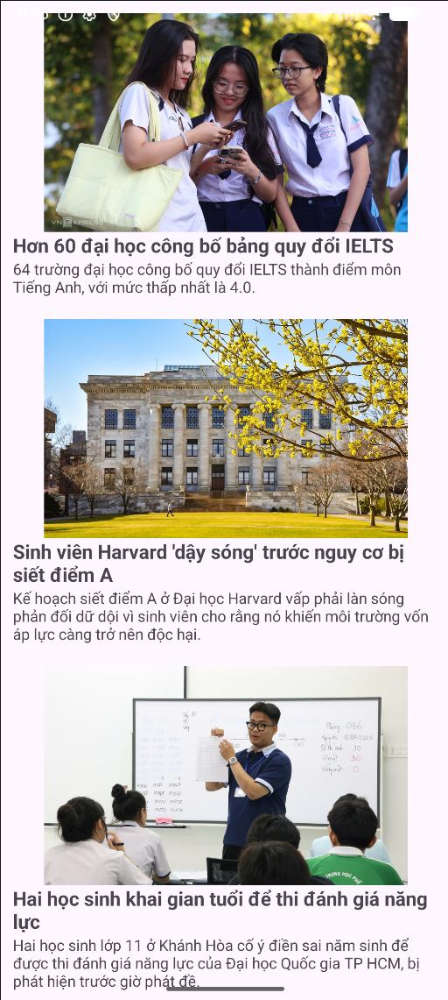
</td>
<td width="30%">
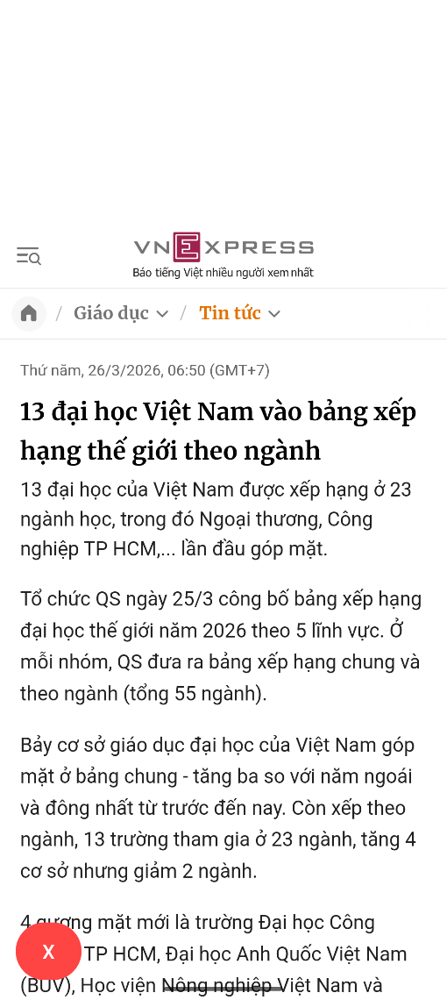
</td>
</tr>
</table>

<a href="./Youtube/"><b>Youtube Bottom Navigation Bar</b></a>

 
<table>
<tr>
<td width="60%" valign="top">
<ul>
  <li>Bottom Navigation Bar</li>
</ul>
</td>
<td width="40%">

</td>
</td>
</tr>
</table>

